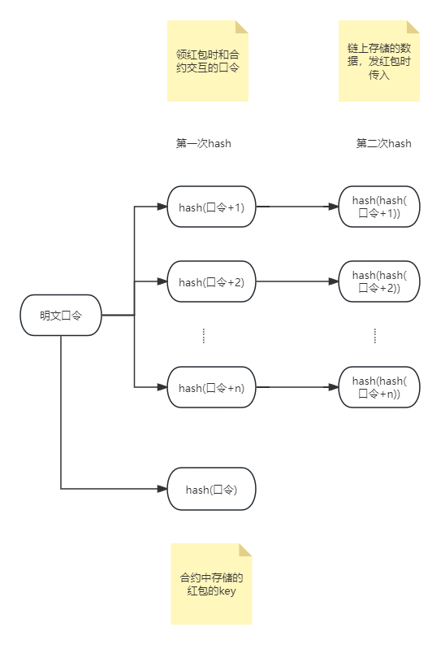

# Web3Project Hongbao 

## 主要功能
1. 拼手气口令红包
2. 猜数字游戏红包（未完成）
3. （准备中）

## 智能合约设计
### 背景
请求智能合约api的数据是全部公开的，可以再浏览器中轻松查询，因此口令需要加密，防止交易后口令泄露。
红包有发和领两个动作，发红包需要加密，且领红包时的口令不仅要加密而且有几份红包就需要有几个不同的口令，防止同一口令被轻松复制重入。

### 设计


#### 整体逻辑
靠hash来完成参数加密，对于合约来说每个领取的用户使用不同的口令
1. 因为hash不可逆，没法得到原口令
2. 通过hash(key) == preSavedValue 可以验证,当前用户知道原口令
3. 通过给口令加固定顺序的值后进行hash，来达到一个口令派生多个口令
4. 每个领取的用户使用不同的口令，使用两次hash来保护口令信息

#### 发红包
传入参数
1. hash(口令)
2. n个二次hash的值，为[hash(hash(口令+1)), hash(hash(口令+2)),...,hash(hash(口令+n))]

红包信息以map存储
key:hash(口令)
value:[hash(hash(口令+1)), hash(hash(口令+2)),...,hash(hash(口令+n))]

#### 领红包
传入参数
1. hash(口令)
2. hash(口令+k) k为1~n中任意一个数

领取验证
上面两个参数记为param1,param2
从map中取到当前红包：redPacket = map.get(param1)
遍历redPacket的二次hash过的值数组内的item
if item == hash(param2) 则验证通过

当前用户是第k个领到红包的用户。


这种设计下口令不会在链上被泄露，能保障安全。
同时前端需要额外处理这部分hash的转换。
而因为k不能重复使用，需要一个可并发的接口来获取k的最新值，每次获取后k+1。
因为链上写入成本高体验差，k的处理需要引入后端。
关键部分的红包发和领取是在链上的，保证安全可靠。

项目使用hardhat搭建
```shell
npx hardhat help
npx hardhat test
REPORT_GAS=true npx hardhat test
npx hardhat node
npx hardhat ignition deploy ./ignition/modules/xxx.js
```
